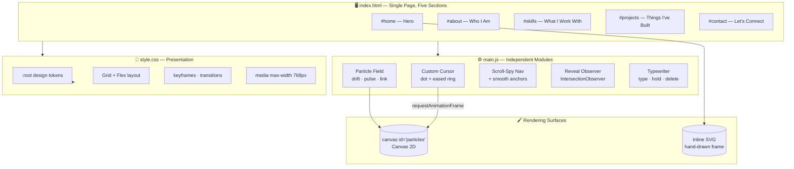

<!-- ══════════════════════════════════════════════════════════════ -->
<!--                        HERO / COVER                            -->
<!-- ══════════════════════════════════════════════════════════════ -->
<div align="center">

# DEVANSH KORDE `PORTFOLIO`

### A mustard-and-ink personal portfolio with a hand-drawn sketch frame, a living constellation field, and a custom cursor — built with zero frameworks, zero dependencies, zero build step.

[](https://devanshkordeportfolio.netlify.app/)
[](https://developer.mozilla.org/en-US/docs/Web/HTML)
[](https://developer.mozilla.org/en-US/docs/Web/CSS)
[](https://developer.mozilla.org/en-US/docs/Web/JavaScript)
[](https://developer.mozilla.org/en-US/docs/Web/API/Canvas_API)
[](#️-tech-stack)

<br/>


<br/>
<br/>

**[🌐 Launch the Site](https://devanshkordeportfolio.netlify.app/)** &nbsp;•&nbsp;
**[⚡ Quick Start](#-quick-start)** &nbsp;•&nbsp;
**[🎬 The Motion Engine](#-the-motion-engine)** &nbsp;•&nbsp;
**[🎛️ Customising](#️-customising)**

</div>

> [!NOTE]
> The site is fully static — no server, no API, no cold start. It loads instantly. The only external requests are Google Fonts and the Font Awesome icon CDN.

---

## The Idea

Most portfolios are a template with the names swapped out. This one isn't.

Every pixel here is hand-written. The wobbly circle around the profile photo is three bézier paths drawn by hand — deliberately imperfect, with a small gap at the bottom so it reads as *sketched* rather than *generated*. The background isn't a static image; it's 90 canvas particles that drift, pulse, link to each other, and reach toward your cursor as you move. The tagline types itself out, deletes itself, and moves on.

No React. No Tailwind. No bundler, no `node_modules`, no build step. **Three files and about 1,270 lines of code** you can read top to bottom in one sitting.

Built as a personal calling card for a **B.Tech IT** student — equal parts résumé, playground, and proof that vanilla still works.

## Features

<table>
<tr>
<td width="50%" valign="top">

### 🖱️ Interaction
- **Two-part custom cursor** — a solid dot that tracks the pointer exactly, plus a larger ring that trails behind with eased interpolation for a soft magnetic feel.
- **Cursor-reactive constellation** — every particle within 140px of your pointer draws a line to it, so the background physically reaches toward you.
- **Smooth anchor scrolling** — all in-page links intercept the default jump and glide instead.
- **Scroll-spy nav** — the active section highlights itself in the navbar as you move down the page.

</td>
<td width="50%" valign="top">

### ✨ Motion
- **Living particle field** — 90 particles drift on independent vectors, pulse their opacity on a sine wave, and re-spawn on exit.
- **Distance-faded links** — any two particles under 100px apart are joined by a line whose opacity fades with distance.
- **Typewriter tagline** — three lines cycle with character-level typing, deletion, and a 2.2s hold.
- **Reveal on scroll** — sections fade in once at 12% visibility via `IntersectionObserver` — no scroll-event thrashing.

</td>
</tr>
<tr>
<td width="50%" valign="top">

### 🎨 Design
- **Hand-drawn SVG frame** — two offset wobbly circles plus an intentional gap stroke, for an unfinished sketch look.
- **Oversized display type** — Bebas Neue at `clamp(4rem, 20vw, 7rem)`, so the name scales with the viewport.
- **Mustard & ink palette** — `#d7b414` against near-black, driven entirely by CSS custom properties.
- **Numbered sections** — `01 / About`, `02 / Skills`… an editorial spine running down the page.

</td>
<td width="50%" valign="top">

### 🪶 Engineering
- **Zero dependencies** — no framework, no package manager, no build pipeline.
- **~1,270 lines total** across three readable files.
- **`requestAnimationFrame` loops** for both the cursor ring and the particle field — no `setInterval` jank.
- **Responsive at 768px** — hero stacks and centres, grids collapse to one column, CTAs go vertical.

</td>
</tr>
</table>

---

## The 5 Sections

The page is a single vertical scroll, split into five numbered stops.

| # | Section | ID | What's there |
|:-:|:--------|:---|:-------------|
| 🟡 | **Hero** | `#home` | Sketch-framed photo, oversized name, typed tagline, two CTAs |
| 🟠 | **About** | `#about` | Background, interests, and a stat card — years coding, projects built, curiosity |
| 🔵 | **Skills** | `#skills` | Two groups: Development and Creative Tools |
| 🟢 | **Projects** | `#projects` | EzGrind, this portfolio, and Code Escape Room — each with stack tags |
| 🩷 | **Contact** | `#contact` | Email CTA plus GitHub, LinkedIn, and Instagram |

### Skills on Display

| Group | Items |
|:------|:------|
| 💻 **Development** | HTML · CSS · JavaScript · Python · Java · SQL |
| 🎬 **Creative Tools** | Photography · Filmmaking · Photoshop · CapCut |

---

## Motion Mechanics

| Behaviour | Value |
|:----------|:------|
| ✨ **Particle count** | 90 |
| 🔗 **Particle-to-particle link range** | 100px |
| 🎯 **Cursor attraction range** | 140px |
| 🖱️ **Cursor ring easing** | `0.12` lerp per frame |
| ⌨️ **Type / delete speed** | 70ms / 35ms per character |
| ⏸️ **Hold at end of line** | 2200ms |
| 👁️ **Reveal threshold** | 12% visibility |
| 📱 **Responsive breakpoint** | 768px |

### The Particle Link Algorithm

Each frame, the renderer walks every unique pair of particles and measures the distance between them. Under 100px, it strokes a line whose alpha is `0.25 × (1 − dist/100)` — so links materialise faintly as particles approach, brighten as they close, and vanish as they drift apart. The same falloff runs against the cursor position at a wider 140px radius and a stronger `0.6` alpha, which is why the field appears to *notice* you.

> ⚠️ This is an O(n²) sweep — roughly 4,000 comparisons per frame at 90 particles. Comfortable on desktop, but it's the first thing to optimise (spatial grid / quadtree) if the count ever grows.

---

## Architecture



**Render lifecycle:** two `requestAnimationFrame` loops run continuously — one easing the cursor ring toward the pointer, one clearing and repainting the particle canvas. Everything else is event-driven: `mousemove` updates cursor coordinates, `scroll` drives the navbar state and active link, and a single `IntersectionObserver` fires each section's reveal exactly once. The typewriter runs on a self-scheduling `setTimeout` chain rather than a fixed interval, so it can vary its own delay between typing, deleting, and holding.

---

## 🛠️ Tech Stack

| Layer | Technology |
|:------|:-----------|
| **Markup** | Semantic HTML5 — one page, five sections |
| **Styling** | Vanilla CSS3 · custom properties · Flexbox · CSS Grid |
| **Behaviour** | ES6 JavaScript — no framework, no transpiler |
| **Graphics** | Canvas 2D API (particles) · inline SVG (sketch frame) |
| **Observers** | `IntersectionObserver` for scroll reveal |
| **Typography** | Bebas Neue (display) · DM Sans (body) · Crimson Pro (italic accents) |
| **Icons** | Font Awesome 6.5 (CDN) |
| **Build** | None — open the file and it runs |
| **Hosting** | Netlify |

---

<a id="-the-motion-engine"></a>

## 🎬 The Motion Engine

`main.js` is a set of self-contained modules, each under 50 lines, sharing no state beyond the pointer position.

| Module | Trigger | What it does |
|:-------|:--------|:-------------|
| 🖱️ **Custom Cursor** | `mousemove` + rAF | Positions the dot instantly; eases the ring toward it at 12% per frame |
| ✨ **Particle Field** | rAF loop | Drifts, pulses, and links 90 particles; re-spawns any that leave the viewport |
| 📌 **Navbar State** | `scroll` | Adds `.scrolled` past 60px for the condensed navbar treatment |
| 🎯 **Scroll Spy** | `scroll` | Marks the nav link whose section is currently in view |
| 👁️ **Reveal** | `IntersectionObserver` | Adds `.in-view` once per section at 12% visibility |
| ⌨️ **Typewriter** | `setTimeout` chain | Cycles three taglines with per-character typing and deletion |
| 🧭 **Smooth Scroll** | `click` on `a[href^="#"]` | Intercepts the jump and calls `scrollIntoView({ behavior: 'smooth' })` |

---

## 📂 Project Structure

```text
Personal-Portfolio/
│
├── Portfolio/                  # 🎨 The site itself (Netlify publish directory)
│   │
│   ├── index.html              #   249 lines — all five sections + inline SVG frame
│   ├── style.css               #   817 lines — tokens, layout, animations, responsive
│   ├── main.js                 #   206 lines — cursor · particles · nav · reveal · typing
│   │
│   └── assets/
│       └── images/
│           └── FormalPhoto.png #   Hero portrait (⚠️ 6.3 MB — see Known Issues)
│
├── assets/
│   └── preview.gif             # 🎬 README demo recording
│
└── README.md
```

> 🪶 There is no `package.json`, no `node_modules`, and no config file. That's the point.

---

## 🎛️ Customising

Everything visual routes through CSS custom properties at the top of `style.css`:

```css
:root {
  --bg:            #d7b414;   /* mustard background        */
  --bg-2:          #0f0f0d;   /* near-black surface        */
  --bg-card:       #111110;   /* card surface              */
  --border:        #b89a0e;   /* muted gold border         */
  --font-display:  'Bebas Neue', sans-serif;
  --font-body:     'DM Sans', sans-serif;
  --font-italic:   'Crimson Pro', serif;
}
```

<details>
<summary><b>🎨 Change the colour scheme</b></summary>

<br/>

Edit the `:root` block in `style.css`. `--bg` is the dominant mustard, `--bg-2` and `--bg-card` are the dark surfaces, and `--border` is the muted gold used for outlines and the ghost button.

Note that the particle canvas paints in **hard-coded black** (`rgba(0, 0, 0, …)` in `main.js`), so if you move to a dark background you'll need to change those fill and stroke colours too — they aren't wired to the CSS variables.

</details>

<details>
<summary><b>⌨️ Change the rotating taglines</b></summary>

<br/>

The `lines` array near the bottom of `main.js`:

```js
const lines = [
  'Crafting digital experiences with logic and creativity.',
  'IT Student · Developer · Photographer.',
  'Building things that matter.',
];
```

Add or remove entries freely — the cycle wraps with a modulo, so any length works.

</details>

<details>
<summary><b>✨ Tune the particle field</b></summary>

<br/>

| Change | Where |
|:-------|:------|
| Density | `PARTICLE_COUNT` (default `90`) |
| Link distance | The `100` threshold in `connectParticles()` |
| Cursor reach | The `140` threshold in the same function |
| Drift speed | `speedX` / `speedY` in `Particle.reset()` (default `±0.175`) |
| Particle size | `this.size` in `reset()` (default `0.3`–`1.7`) |
| Pulse rate | `this.pulse += 0.012` in `update()` |

</details>

<details>
<summary><b>🖼️ Swap the photo and sketch frame</b></summary>

<br/>

Replace `Portfolio/assets/images/FormalPhoto.png` — **please compress it first.**

The frame itself is inline SVG in `index.html` under `.sketch-frame`: three paths (`.sketch-outer`, `.sketch-inner`, `.sketch-gap`) on a `0 0 400 400` viewBox. Nudge the bézier control points to change how wobbly it reads, or delete `.sketch-gap` to close the loop.

</details>

<details>
<summary><b>🗂️ Add or edit projects</b></summary>

<br/>

Duplicate a `.project-card` block in the projects section of `index.html`:

```html
<div class="project-card">
  <div class="project-number">04</div>
  <div class="project-body">
    <h3 class="project-title">Project Name</h3>
    <p class="project-desc">What it does.</p>
    <div class="project-stack"><span>Tech</span><span>Tech</span></div>
    <div class="project-links">
      <a href="URL" target="_blank" class="project-link">
        <i class="fas fa-arrow-up-right-from-square"></i> Live Demo
      </a>
    </div>
  </div>
</div>
```

Add `featured` to the class list to give it the larger treatment.

</details>

---

<a id="-quick-start"></a>

## ⚡ Quick Start

> **Prerequisites:** a browser. That's it. No Node, no Python, no package manager.

```bash
# 1 — Clone
git clone https://github.com/devanshkorde/Personal-Portfolio.git
cd Personal-Portfolio/Portfolio

# 2 — Serve it locally (pick one)
python -m http.server 8000     # Python
npx serve .                    # Node
# …or just open index.html directly in a browser
```

Then open **<http://localhost:8000>**.

> A local server isn't strictly required for this site, but it's the better habit — `file://` blocks some browser APIs and makes relative paths behave inconsistently.

### 🚀 Deploying

The site is fully static, so any host works — Netlify, Vercel, GitHub Pages, Cloudflare Pages.

| Setting | Value |
|:--------|:------|
| **Publish directory** | `Portfolio/` |
| **Build command** | *(leave empty)* |
| **Environment variables** | none |

> ⚠️ The publish directory matters. Point it at the repo root and you'll deploy the README instead of the site.

---

## 🐛 Known Issues

An honest list — these are real, and they're all fixable.

| Issue | Impact | Fix |
|:------|:-------|:----|
| 🔴 **`FormalPhoto.png` is 6.3 MB** | Dominates load time; brutal on mobile data | Compress and serve WebP — should drop 90%+ |
| 🟠 **Portfolio project card links to `#`** | The "View Code" button is dead on the live site | Point it at this repo |
| 🟠 **`cursor: none` is set globally** | On touch/hybrid devices the native cursor is hidden with nothing replacing it | Gate behind `@media (hover: hover)` |
| 🟡 **No mobile nav menu** | Below 768px the links stay in a row instead of collapsing | Add a hamburger toggle |
| 🟡 **No `prefers-reduced-motion` handling** | Particles, typing, and reveals run regardless of user preference | Wrap the rAF loops in a media query check |
| 🟡 **Particle linking is O(n²)** | ~4,000 comparisons/frame — fine now, won't scale | Spatial grid or quadtree if the count grows |
| ⚪ **Particle colours hard-coded** | Canvas paints black regardless of the CSS theme | Read from `getComputedStyle` on `:root` |

---

## 🗺️ Roadmap

- [ ] Compress and convert the hero image to WebP
- [ ] Mobile hamburger navigation
- [ ] `prefers-reduced-motion` support across all animations
- [ ] Wire particle colours to the CSS custom properties
- [ ] Dark/light theme toggle
- [ ] Open Graph + Twitter card meta tags for link previews
- [ ] Lighthouse pass — target 95+ on all four metrics
- [ ] Blog or writing section

---

## 🔗 Other Projects

| Project | Description |
|:--------|:------------|
| **[EzGrind](https://github.com/devanshkorde/EzGrind)** | Full-stack fitness tracker — workout logging with weight, reps, and time-under-tension, session auth, and a progress dashboard. Flask + MySQL. |
| **[Code Escape Room](https://github.com/devanshkorde/Code-Escape-Room)** | Matrix-themed, AI-powered cybersecurity quiz platform. NVIDIA NIM adapts puzzle difficulty from player performance — improved average completion rates by 12%. |
| **[TruthLens AI](https://github.com/devanshkorde/TruthLens-AI)** | Real-time fake news and deepfake detection across text and images, with reasoning and a credibility score. |

---

## 📄 License & Acknowledgements

Built as a **personal project**. Typography by [Google Fonts](https://fonts.google.com/) (Bebas Neue, DM Sans, Crimson Pro); icons by [Font Awesome](https://fontawesome.com/); hosted on [Netlify](https://www.netlify.com/).

Feel free to read the code and learn from it — but please build your own identity rather than shipping mine with the name swapped.

---

## 📬 Contact

<div align="center">

**Devansh Korde** — B.Tech Information Technology, Medicaps University · Indore, India

[](mailto:devanshkorde195@gmail.com)
[](https://www.linkedin.com/in/devansh-korde-6a6846333/)
[](https://github.com/devanshkorde)
[](https://www.instagram.com/devansh_korde/)

<br/>

**`> BUILDING THINGS THAT MATTER.`**

⭐ *If the constellation caught your eye, drop a star on the repo.* ⭐

</div>
